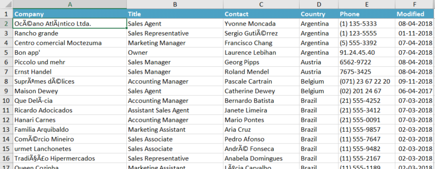
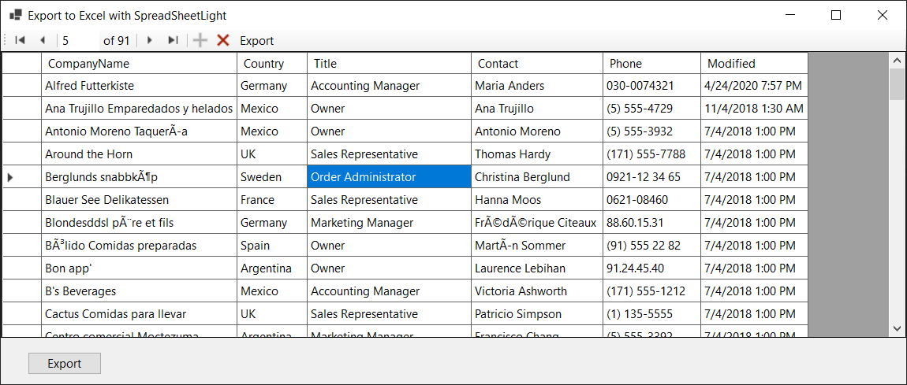

# How to better interact with data in Window Forms

Learn the basics of working with a BindingList and BindSource where the objective is to export stong typed to Excel formated and unformated along with some ideas for better interacting with data in a DataGridView plus revealing the Missing BindingNavigator in Visual Studio 2022.

The included repository is for showing several important things, properly working with data in a `DataGridView` using `BindingList` and `BindingSource` and easily exporting data to `Excel` which in the provided code samples are from a DataGridView. Also promotes using class projects for reusable code rather than copy and pasting code from project to projects.

Some might wonder why this is done in Windows Form projects.  Although today web projects are the dominate project types there are still use cases for working with Window Forms such as the need to quickly put together side projects for web application as utility projects along with there are still countless developers who are still writing desktop applications.

When using a BindingList and a BindingSource there is zero need to touch cells in a DataGridView as the combination provides rich functionality from finding data, editing, adding and deleting data. Typically a new developer tends to not load strong type data to a DataGridView DataSource but instead adds rows which is not strongly typed which frankly makes working with data cumbersome while working with a BindingList and a BindingSource simplifies all operations. The exception to this is using DataTable or DataSets components which is one step below using a BindingList and a BindingSource.


## Export from DataGridView to Excel raw

For exporting a DataGridView, no Excel automation is used. In one example an extension method for a DataGridView is used which accepts a file name to create a .csv file and a parameter to specify a value when a cell value is null.

```csharp
public static void ExportRowsRaw(this DataGridView sender, string fileName, string defaultNullValue = "(empty)")
{
    File.WriteAllLines(fileName, sender.Rows.Cast<DataGridViewRow>()
        .Where(row => !row.IsNewRow)
        .Select(row => new RowRecord(
            row, string.Join(",", Array.ConvertAll(row.Cells.Cast<DataGridViewCell>()
                .ToArray(), cell => (cell.Value == null) ?
                defaultNullValue :
                cell.Value.ToString()))
        ))
        .Select(@row => @row.RowItem));
}
```

Usage

```csharp
dataGridView1.ExportRowsRaw("contacts.csv");
```

Using the above extension has no cell formatting.

## Export from DataGridView to Excel with formatting

The second example is tied to a specific model and format cell values and the header row using NuGet package [SpreadSheetLight](https://www.nuget.org/packages/SpreadsheetLight). Yes there are many libraries out there but for a free library this one does nicely for formatting and exporting data.

```csharp
public class CustomersForExcel
{
    public int Id { get; set; }
    public string CompanyName { get; }
    public string Country { get; }
    public string Title { get; }
    public string Contact { get; }
    public string Phone { get; }
    public DateTime Modified { get; set; }
    public override string ToString() => CompanyName;

    public CustomersForExcel(string companyName, string country, string title, string contact, string phone, DateTime? modifiedDateTime, int id)
    {
        CompanyName = companyName;
        Country = country;
        Title = title;
        Contact = contact;
        Phone = phone;
        if (modifiedDateTime != null) Modified = modifiedDateTime.Value;
        Id = id;
    }
}
```

To export a DataGridView from a List to SpreadSheetLight we need to convert the list to a DataTable using NuGet package [FastMember](https://www.nuget.org/packages/FastMember).

Given a list `List<CustomersForExcel> list`, create a new DataTable `DataTable table = new();` creates an instance of ObjectReader from FastMember followed by populating the DataTable `table.Load(reader);`.

Next create and instance of [SLDocument](https://spreadsheetlight.com/tutorial/) which represents the root object from SpreadSheetLight to interact with a new or existing Excel file.

> **Note**
> On the [home page](https://spreadsheetlight.com/) for SpreadSheetLight you can download a extensive help file.


```csharp
using var document = new SLDocument();
```

Create a SLStyle (SpreadSheetLight class for styling cells) for the header row.

```csharp
public static SLStyle HeaderStye(SLDocument document)
{
        
    SLStyle headerStyle = document.CreateStyle();

    headerStyle.Font.Bold = true;
    headerStyle.Font.FontColor = Color.White;
    headerStyle.Fill.SetPattern(
        PatternValues.LightGray,
        SLThemeColorIndexValues.Accent1Color,
        SLThemeColorIndexValues.Accent5Color);

    return headerStyle;
}
```

Create a variable for the style.

```csharp
var headerStyle = HeaderStye(document);
```

Next, there is a Date property/column which needs formatting. We create a style for the column.

```csharp
SLStyle dateStyle = document.CreateStyle();
dateStyle.FormatCode = "mm-dd-yyyy";
```

Next, use SpreadSheetLight ImportDataTable method.

```csharp
document.ImportDataTable(1, SLConvert.ToColumnIndex("A"), table, true);
```

- Parameter 1, row to start on
- Parameter 2, cell to start on
- Parameter 3. the DataTable to import
- Parameter 4, should header be included

For this example, hide the column for the primary key 

```csharp
document.HideColumn(7, 7);
```

Set the column style for the Date column.

```csharp
document.SetColumnStyle(dateColumnIndex, dateStyle);
```

Auto size columns

```csharp
for (int columnIndex = 1; columnIndex < table.Columns.Count; columnIndex++)
{
    document.AutoFitColumn(columnIndex);
}

document.AutoFitColumn(dateColumnIndex + 1);
```

Set first row style

```csharp
document.SetCellStyle(1, 1, 1, 6, headerStyle);
```

Want a specific cell focused?

```csharp
document.SetActiveCell("A2");
```

Ensure header is visible when scrolling down

```csharp
document.FreezePanes(1,6);
```

Save to a new file.

```csharp
document.SaveAs(fileName);
```

Calling the above method, use a try-catch

- On sucess indicate this to the user
- Check if someone currently had the file open
- Check for general exceptions.

```csharp
private void ExportButton_Click(object sender, EventArgs e)
{
        
    try
    {
        NorthWindOperations.CustomersToExcel(_bindingList.ToList(), Path.Combine(AppDomain.CurrentDomain.BaseDirectory, "Customers.xlsx"));
        MessageBox.Show("Done");
    }
    catch (Exception exception) when (exception.Message.Contains("The process cannot access the file"))
    {
        MessageBox.Show("Hey you have the spreadsheet open, can not save!!!");
    }
    catch (Exception exception)
    {
        MessageBox.Show($"Something went wrong '{exception.Message}'");
    }
}
```

Finished product



In the screenshot above, the sort is on Company but if the user sorts on another column the Excel WorkSheet will be sorted on the sort column of the DataGridView.

> **Note**
> In regards to sorting, using a standard BindingList does not handle sorting. To Get sorting see BindingListLibrary.SortableBindingList class.


## Some benefits for BindingSource/BindingList

As menetioned earlier, a new developer adds data by rows/cells which makes it hard to access, edit and find data.

When coupling a BindingSource with a BindingList, to find data without touching the DataGridView is easy. Here we want to find a specific first name from a TextBox and here update to a static value.

```csharp
private void FindAndUpdateButton_Click(object sender, EventArgs e)
{
    if (!string.IsNullOrWhiteSpace(FindByFirstNameTextBox.Text))
    {
        Contact contact = _bindingSource
            .List
            .OfType<Contact>()
            .ToList()
            .Find(x => x.FirstName == FindByFirstNameTextBox.Text);

        contact.FirstName = "Karen";
    }

}
```

The above can also work against other columns for instance find a item by primary key.

Another common operation is to get values from the current row of a DataGridView. This is done by indexing into a BindingList using Position property of a BindingSource where Position is the current row of the DataGridView.

```csharp
Contact contact = _bindingList[_bindingSource.Position];
```

Now it may be possible that there is no current row so its wise to assert for a current row.

```csharp
if (_bindingSource.Current is not null)
{
    Contact contact = _bindingList[_bindingSource.Position];
}
```

## BindingNavigator

You can use the BindingNavigator control to create a standardized means for users to search and change data on a Windows Form. You frequently use BindingNavigator with the BindingSource component to enable users to move through data records on a form and interact with the records.

Sadly in Visual Studio 2022 the BindingNavigator component is missing from Visual Studio toolbox.

To include it use `CoreBindingNavigator` found in the project WindowsFormControlsLibrary.

Once WindowsFormControlsLibrary is added as a reference and build the project the BindingNavigator will show up in Visual Studio's toolbox.

In the project DataGridViewExport1 CoreBindingNavigator is used plus a button is added to mirror a standard button to export the DataGridView to Excel.





## Summary

- By using strongly typed data in a DataGridView 
    - There is no need to convert objects to a given type.
    - Locating and filtering data is easier
    - Work with pre-done components e.g. [DataGridView Filter popup](https://www.codeproject.com/Articles/33786/DataGridView-Filter-Popup).

- By using BindingList/BindingSource
    - You are not limited to just DataGridView, bindings can be done on TextBoxes for instance.


| Project        |   Description    
|:------------- |:-------------|:-------------|
|  BindingListLibrary | Contains helpful extensions and a sortable BindingList component |
|  DataGridViewLibrary | Contains extensions for exporting a DataGridView to Excel without formatting, a method to quickly convert a generic list to a DataTable. Extension method to auto-size DataGridView columns and extension method to auto-size specific columns rather than all columns|
| NorthWind2020Library  | Access to NorthWind database which is used in project DataGridViewExport1  |
| DataGridViewExport | Windows form project which shows how to export a DataGridView data to a .csv file suitable for opening in Excel with no cell formatting |
| DataGridViewExport1 | Windows form project which exports NorthWind data to Excel with cell formatting for Excel |
| SpreadSheetLightImportDataTable | Provides code to export a DataTable which was originally a list to Excel. Also has useful methods and extension methods for working with Excel using NuGet package SpreadSheetLight |
| SpreadsheetLightLibrary | Helpful methods for NuGet package SpreadSheetLight |
| WindowFormsControlsLibrary | Library for Windows Forms controls, in this case has a class to bring back a BindingNavigator missing from Visual Studio 2022 |